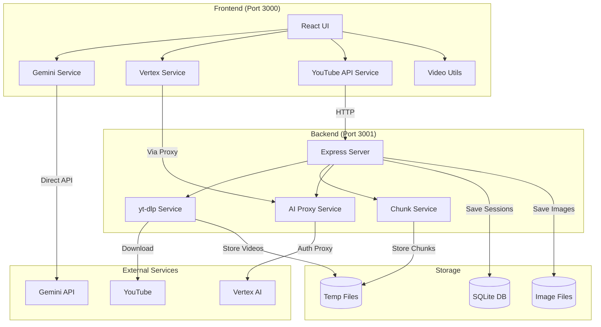
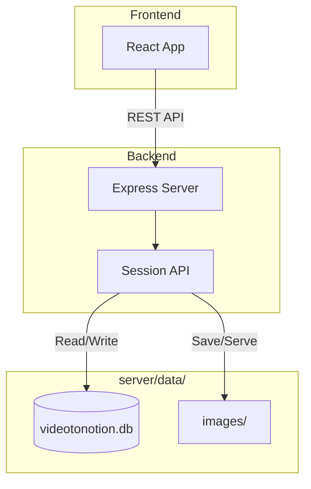

# System Architecture

This document provides a comprehensive overview of the Video to Notion system architecture.

## Monorepo Structure

Video to Notion is a **monorepo** containing two packages:

```
videotonotion/
├── package.json          # Root package (frontend + orchestration)
├── server/
│   └── package.json      # Backend package
└── pnpm-lock.yaml        # Shared lock file
```

### Package Relationship


## High-Level Architecture



## Frontend Architecture

### Technology Stack

| Component | Technology | Purpose |
|-----------|------------|---------|
| Framework | React 19 | UI rendering and state management |
| Build Tool | Vite 6 | Fast development server and bundling |
| Language | TypeScript | Type safety |
| Icons | Lucide React | UI icons |
| AI Client | @google/genai | Direct Gemini API calls |

### Directory Structure

```
/                           # Root (Frontend)
├── App.tsx                 # Main application, state management
├── main.tsx                # Application entry point
├── index.html              # HTML template
├── components/
│   ├── VideoInput.tsx      # File upload and URL input
│   ├── NotesPreview.tsx    # Rendered notes display
│   ├── ProcessingView.tsx  # Progress indicators
│   ├── Sidebar.tsx         # Session management
│   └── ProviderSelector.tsx # AI provider configuration
├── services/
│   ├── aiProviderService.ts # AI provider abstraction
│   ├── geminiService.ts     # Direct Gemini API integration
│   ├── vertexService.ts     # Vertex AI via backend proxy
│   └── youtubeApiService.ts # YouTube backend communication
├── utils/
│   └── videoUtils.ts        # Base64 conversion, frame extraction
├── types.ts                 # TypeScript interfaces
├── constants.ts             # Configuration constants
├── tsconfig.json            # TypeScript config
└── vite.config.ts           # Vite configuration
```

### State Management

The application uses React's built-in state management with `useState` and `useEffect` hooks. The main state is managed in `App.tsx`:

```typescript
// Core state
const [sessions, setSessions] = useState<VideoSession[]>([]);
const [selectedSessionId, setSelectedSessionId] = useState<string | null>(null);
const [aiConfig, setAiConfig] = useState<AIConfig | null>(null);
```

### VideoSession State Machine


## Backend Architecture

### Technology Stack

| Component | Technology | Purpose |
|-----------|------------|---------|
| Framework | Express.js | HTTP server and routing |
| Runtime | Node.js | JavaScript runtime |
| Language | TypeScript | Type safety |
| Database | better-sqlite3 | SQLite for session persistence |
| Video Download | yt-dlp | YouTube video downloading |
| Video Processing | ffmpeg | Video chunking and frame extraction |
| Validation | Zod | Request/response validation |

### Directory Structure

```
server/
├── index.ts                # Express server entry point
├── routes/
│   ├── youtube.ts          # YouTube download/chunk endpoints
│   ├── ai.ts               # Vertex AI proxy endpoint
│   └── sessions.ts         # Session CRUD endpoints
├── services/
│   ├── ytdlpService.ts     # yt-dlp wrapper for downloads
│   ├── chunkService.ts     # ffmpeg video chunking
│   ├── aiService.ts        # Vertex AI integration
│   └── imageStorageService.ts # Image file operations
├── db/
│   ├── index.ts            # SQLite connection setup
│   ├── schema.ts           # Database schema definitions
│   └── sessionRepository.ts # Data access layer
├── utils/
│   └── urlUtils.ts         # URL validation utilities
├── data/                   # (gitignored) Runtime data
│   ├── videotonotion.db    # SQLite database file
│   └── images/             # Stored note images
├── package.json
├── tsconfig.json
└── VIDEO_REQUIREMENTS.md   # Gemini video constraints
```

### Request Flow


## AI Provider Architecture

The application supports two AI providers through a unified interface:

### Provider Abstraction


### Provider Comparison

| Feature | Gemini API | Vertex AI |
|---------|-----------|-----------|
| Authentication | API Key | Google Cloud ADC |
| Call Location | Browser (direct) | Server (proxied) |
| Setup Complexity | Simple | Requires gcloud CLI |
| Billing | Pay-as-you-go | GCP project billing |

### Configuration

```typescript
// Gemini API Configuration
{
  provider: 'gemini',
  apiKey: 'your-api-key',
  model: 'gemini-3-pro-preview'
}

// Vertex AI Configuration
{
  provider: 'vertex',
  projectId: 'your-gcp-project',
  location: 'us-central1',
  model: 'gemini-3-pro-preview'
}
```

## Storage Architecture

### Database Storage (SQLite + Filesystem)

The application uses a hybrid storage approach:
- **SQLite database** for session metadata and note content
- **Filesystem** for note images (stored as JPEG files)



**Database Schema:**
- **sessions**: Session metadata (id, title, url, status, dates)
- **chunks**: Video chunk info for large files
- **notes**: Note segments (timestamp, title, markdown, image_path)

**Storage Details:**
- **Location**: `server/data/videotonotion.db`
- **Images**: `server/data/images/{sessionId}/note-{index}.jpg`
- **Persistence**: Permanent until deleted via API
- **Migration**: Auto-migrates from localStorage on first load
- **Backup**: Single database file + images folder

### Server-Side Storage (Temporary)


**Storage Details:**
- **Location**: `{os.tmpdir()}/videotonotion/{sessionId}/`
- **Contents**: Downloaded videos and chunk files
- **Lifecycle**: Auto-cleaned after 1 hour of inactivity
- **Management**: In-memory session Map tracks active sessions

## Communication Patterns

### Vite Proxy Configuration

The frontend uses Vite's proxy to forward API requests to the backend:

```typescript
// vite.config.ts
server: {
  port: 3000,
  proxy: {
    '/api': {
      target: 'http://localhost:3001',
      changeOrigin: true,
    },
  },
}
```

### Data Flow Summary

| Flow | Method | Description |
|------|--------|-------------|
| File Upload | Frontend only | File → Base64 → Gemini → Notes |
| YouTube | Frontend + Backend | URL → yt-dlp → Chunks → Base64 → Gemini → Notes |
| Frame Extract (local) | Frontend only | Video element → Canvas → JPEG data URL |
| Frame Extract (YouTube) | Frontend + Backend | ffmpeg → JPEG → Base64 |
| Vertex AI | Frontend + Backend | Request → Proxy → Vertex API → Response |

## Path Aliases

The project uses TypeScript path aliases for cleaner imports:

```typescript
// tsconfig.json
{
  "compilerOptions": {
    "paths": {
      "@/*": ["./*"]
    }
  }
}
```

Usage:
```typescript
import { NoteSegment } from '@/types';
import { fileToBase64 } from '@/utils/videoUtils';
```
