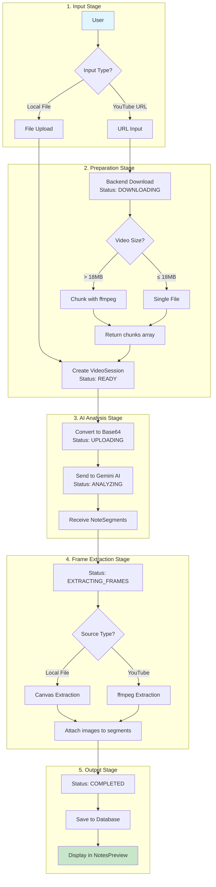
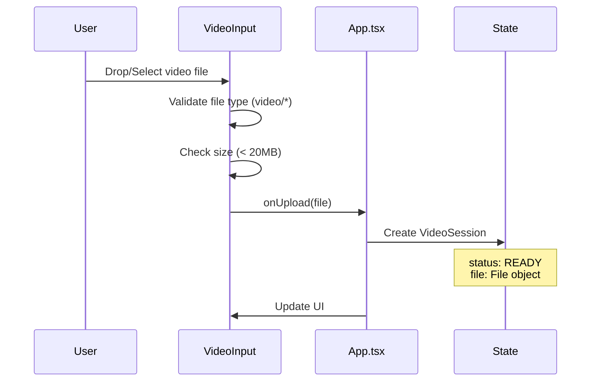
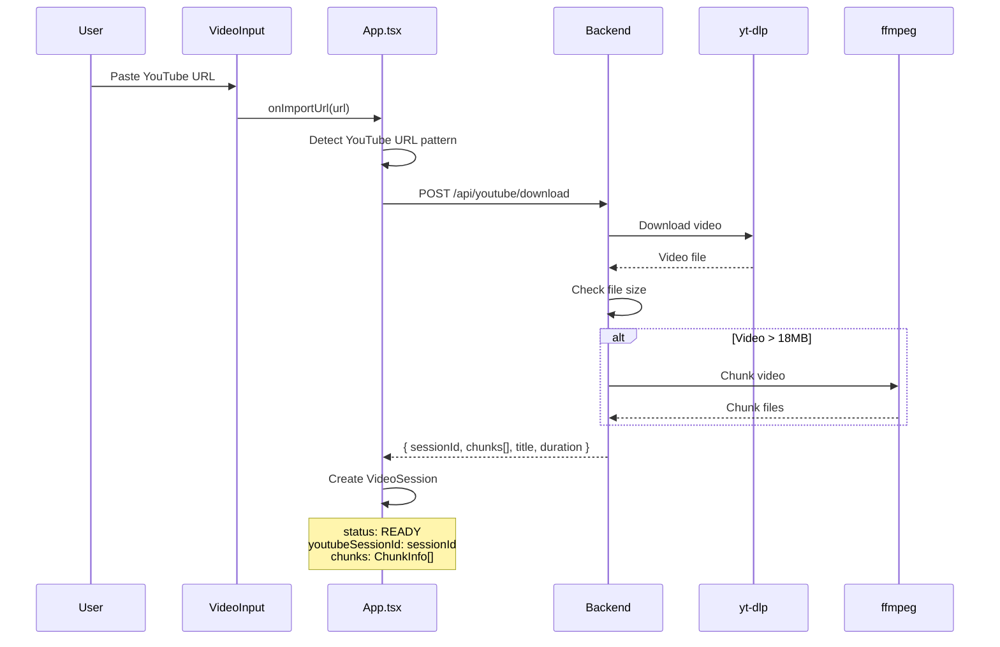
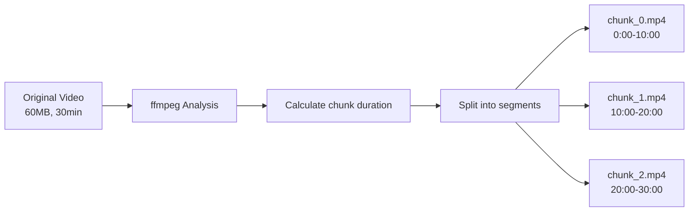
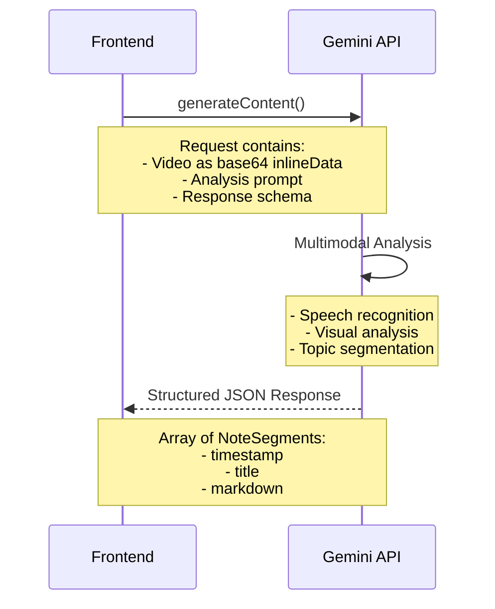
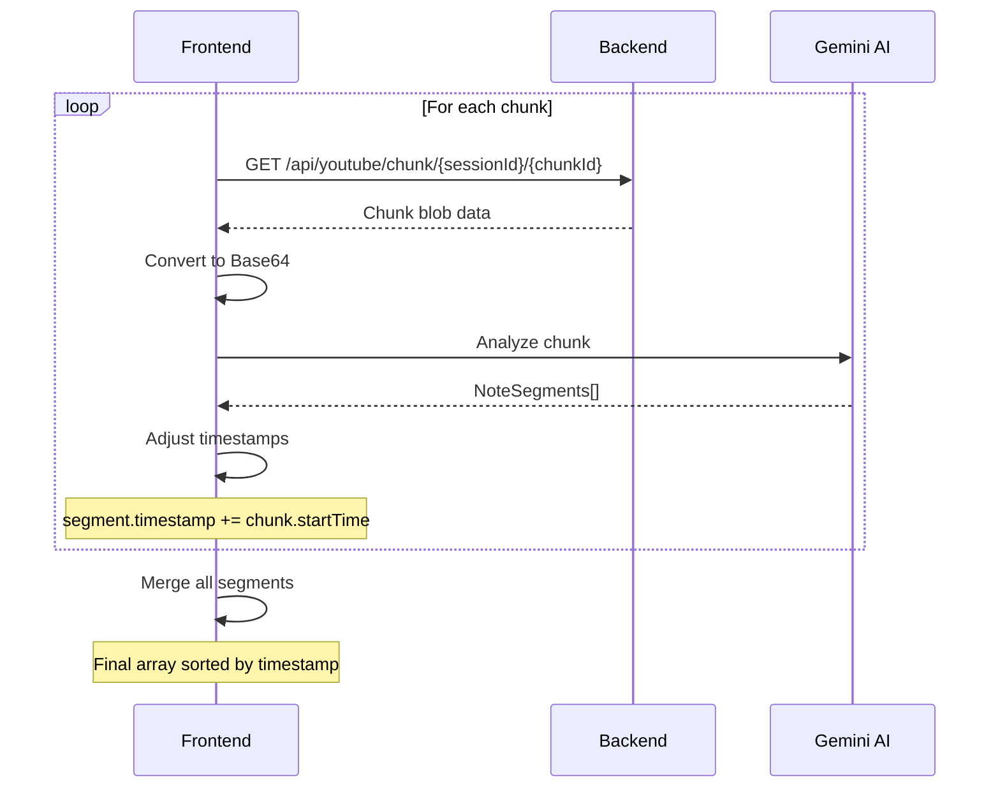
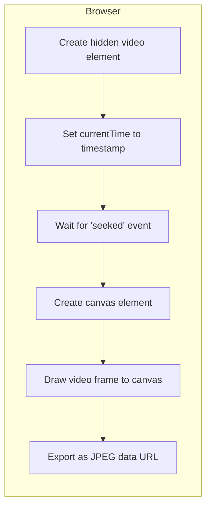
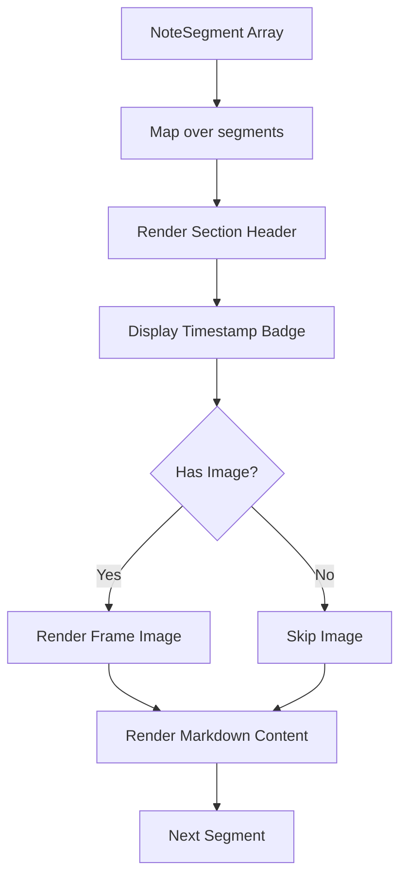
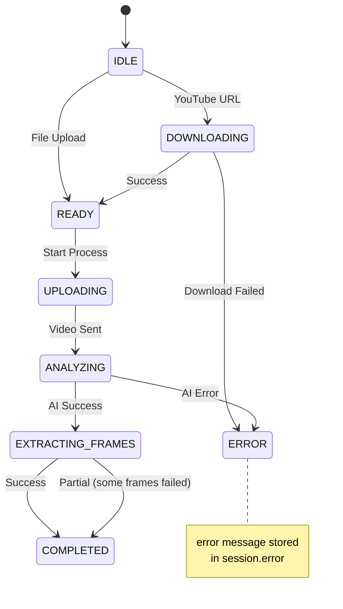

# Video Processing Pipeline

This document provides a detailed end-to-end explanation of how videos are processed in Video to Notion.

## Overview

The video processing pipeline transforms video content into structured, Notion-ready notes through the following stages:

1. **Input** - Video file upload or YouTube URL
2. **Preparation** - Download (if URL) and chunking (if large)
3. **AI Analysis** - Send to Gemini for multimodal analysis
4. **Frame Extraction** - Extract key frames at identified timestamps
5. **Output** - Display notes with images and export options

## Complete Processing Flow



## Input Methods

### File Upload

**Component:** `components/VideoInput.tsx`



**Supported Formats:**
- video/mp4
- video/webm
- video/quicktime
- video/mpeg
- video/x-flv
- video/wmv
- video/3gpp

**Size Limit:** 20MB (client-side, configurable in `constants.ts`)

### YouTube URL

**Component:** `components/VideoInput.tsx` + `server/routes/youtube.ts`



**Supported YouTube URL Patterns:**
- `youtube.com/watch?v=VIDEO_ID`
- `youtu.be/VIDEO_ID`
- `youtube.com/shorts/VIDEO_ID`
- `youtube.com/embed/VIDEO_ID`

## Video Chunking

Large videos are split into chunks to work within Gemini's video length limits.

### Chunk Configuration

| Setting | Default | Environment Variable |
|---------|---------|---------------------|
| Chunk Size Target | 15MB | `CHUNK_SIZE_MB` (backend) |
| Frontend Threshold | 15MB | `VITE_CHUNK_SIZE_MB` (frontend) |
| Chunk Duration | Calculated based on bitrate | - |
| Min Chunks | 1 | - |
| Max Video Length | 45 min (with audio) | - |

> **Tip:** Reduce chunk size (e.g., 5MB) if hitting 429 rate limit errors.

### Chunking Process



**ChunkInfo Structure:**
```typescript
interface ChunkInfo {
  id: number;        // Chunk index (0, 1, 2, ...)
  startTime: number; // Start time in seconds
  endTime: number;   // End time in seconds
}
```

## AI Analysis

### Base64 Conversion

**Utility:** `utils/videoUtils.ts`

```typescript
export const fileToBase64 = (file: File): Promise<string> => {
  return new Promise((resolve, reject) => {
    const reader = new FileReader();
    reader.readAsDataURL(file);
    reader.onload = () => {
      const result = reader.result as string;
      // Strip data URL prefix: "data:video/mp4;base64,"
      const base64 = result.split(',')[1];
      resolve(base64);
    };
    reader.onerror = reject;
  });
};
```

### Gemini API Request

**Service:** `services/geminiService.ts`



### Analysis Prompt

The AI is instructed to:
1. Analyze the video as a technical lecture
2. Identify key topics and natural transitions
3. Provide exact timestamps where content appears
4. Generate concise section titles
5. Write detailed summary paragraphs

### Response Schema

```typescript
const RESPONSE_SCHEMA = {
  type: Type.ARRAY,
  items: {
    type: Type.OBJECT,
    properties: {
      timestamp: {
        type: Type.NUMBER,
        description: "Timestamp in seconds"
      },
      title: {
        type: Type.STRING,
        description: "Section title"
      },
      markdown: {
        type: Type.STRING,
        description: "Detailed summary content"
      },
    },
    required: ["timestamp", "title", "markdown"],
  },
};
```

### Multi-Chunk Processing

For chunked videos, each chunk is processed separately and timestamps are adjusted:



**Timestamp Adjustment Example:**
```
Chunk 0 (0:00-10:00): segments at [30s, 180s, 420s]
Chunk 1 (10:00-20:00): segments at [45s, 300s]
  → Adjusted to [645s, 900s] (45+600, 300+600)

Final: [30s, 180s, 420s, 645s, 900s]
```

## Frame Extraction

### Browser-Side Extraction (Local Files)

**Utility:** `utils/videoUtils.ts`



**Implementation Details:**
```typescript
export const extractFrameFromVideo = async (
  videoUrl: string,
  timestamp: number
): Promise<string> => {
  return new Promise((resolve, reject) => {
    const video = document.createElement('video');
    video.crossOrigin = "anonymous";
    video.src = videoUrl;      // Blob URL for local files
    video.muted = true;
    video.currentTime = timestamp;

    const timeout = setTimeout(() => {
      reject(new Error("Frame extraction timed out"));
    }, 5000);

    video.addEventListener('seeked', () => {
      const canvas = document.createElement('canvas');
      canvas.width = video.videoWidth;
      canvas.height = video.videoHeight;
      const ctx = canvas.getContext('2d');
      ctx.drawImage(video, 0, 0);

      const dataUrl = canvas.toDataURL('image/jpeg', 0.8);
      clearTimeout(timeout);
      video.remove();
      resolve(dataUrl);
    }, { once: true });

    video.load();
  });
};
```

### Server-Side Extraction (YouTube Videos)

**Service:** `server/routes/youtube.ts`

```mermaid
sequenceDiagram
    participant F as Frontend
    participant B as Backend
    participant FF as ffmpeg

    F->>B: GET /api/youtube/frame/{sessionId}?timestamp=120
    B->>B: Locate video file
    B->>FF: Extract frame at 120s
    Note over FF: ffmpeg -ss 120 -i video.mp4<br/>-vframes 1 -f image2 -
    FF-->>B: JPEG buffer
    B->>B: Convert to Base64
    B-->>F: { image: "data:image/jpeg;base64,..." }
```

### Frame Integration

Each extracted frame is attached to its corresponding NoteSegment:

```typescript
const enrichedSegments: NoteSegment[] = [];

for (const segment of segments) {
  try {
    let frameData: string;

    if (isYouTube) {
      frameData = await extractFrameFromServer(sessionId, segment.timestamp);
    } else {
      frameData = await extractFrameFromVideo(blobUrl, segment.timestamp);
    }

    enrichedSegments.push({ ...segment, image: frameData });
  } catch (error) {
    // Skip frame if extraction fails
    enrichedSegments.push(segment);
  }
}
```

## Output Structure

### NoteSegment Interface

```typescript
interface NoteSegment {
  timestamp: number;   // Seconds from video start
  title: string;       // Section title (e.g., "Introduction to React Hooks")
  markdown: string;    // Detailed summary content
  image?: string;      // JPEG data URL (used during processing)
  imageUrl?: string;   // Server URL for persisted images (from database)
}
```

### Example Output

```json
[
  {
    "timestamp": 30,
    "title": "Introduction",
    "markdown": "The presenter introduces the main topic of React state management, explaining why it's crucial for building interactive applications...",
    "image": "data:image/jpeg;base64,/9j/4AAQSkZJRg..."
  },
  {
    "timestamp": 180,
    "title": "useState Hook Basics",
    "markdown": "This section covers the fundamental useState hook. The presenter demonstrates creating a counter component with increment and decrement functionality...",
    "image": "data:image/jpeg;base64,/9j/4AAQSkZJRg..."
  }
]
```

### Display Component

**Component:** `components/NotesPreview.tsx`



## Error Handling

### Processing Status Flow with Errors



### Common Error Scenarios

| Error | Stage | Handling |
|-------|-------|----------|
| Invalid file type | Input | UI validation, user feedback |
| File too large | Input | UI validation, size limit message |
| YouTube unavailable | Download | Error toast, retry option |
| Age-restricted video | Download | Error message with explanation |
| AI quota exceeded | Analysis | Error with retry suggestion |
| Frame extraction timeout | Extraction | Skip frame, continue processing |

## Performance Considerations

### Memory Management

1. **Blob URLs**: Created for local video playback, revoked after processing
2. **Base64 Data**: Large strings held temporarily during API calls
3. **Frame Images**: Stored as data URLs in memory until session ends

### Optimization Strategies

1. **Chunked Processing**: Large videos split to avoid memory issues
2. **Sequential Frame Extraction**: One frame at a time to prevent memory spikes
3. **Image Compression**: JPEG quality set to 80% for balance of quality/size
4. **Filesystem Storage**: Images saved as files, not in database, for efficiency

## Gemini Video Constraints

From `server/VIDEO_REQUIREMENTS.md`:

| Constraint | Limit |
|------------|-------|
| Max video length (with audio) | ~45 minutes |
| Max video length (without audio) | ~1 hour |
| Max videos per prompt | 10 |
| Default resolution tokens per frame | 70 |
